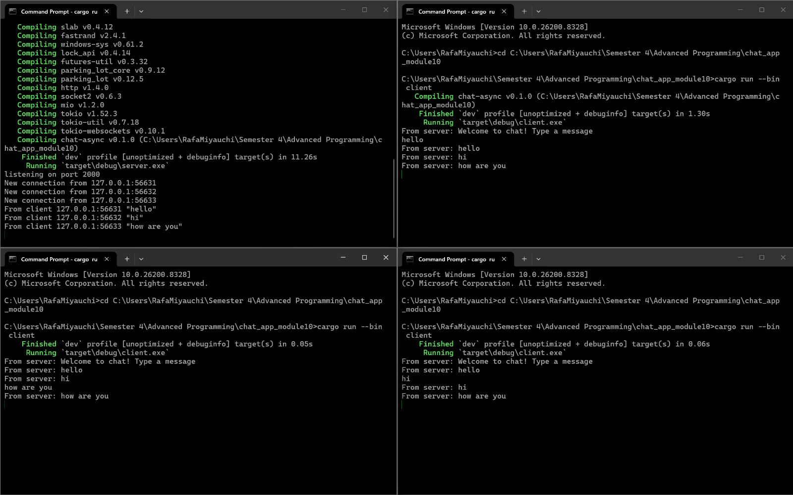
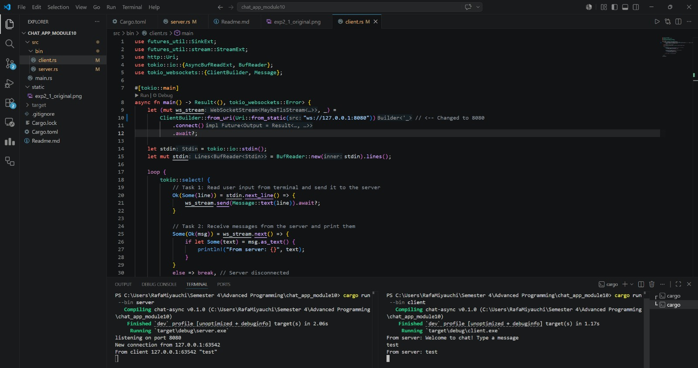
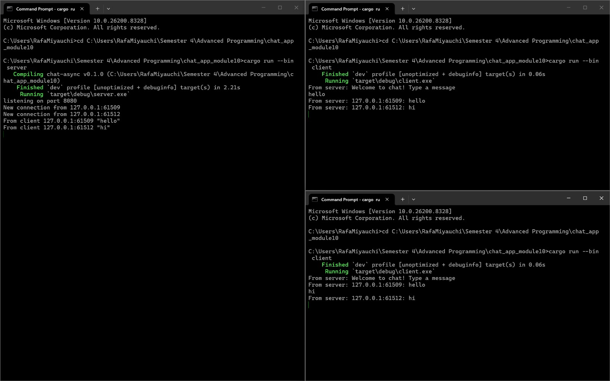

# Module 10 - Async Chat Application

## Experiment 2.1: Original code, and how it run

**How to run and what happens:**
To run the application, I opened multiple terminal instances. In the first terminal, I started the server using `cargo run --bin server`. In the other terminals, I started the clients using `cargo run --bin client`. When text is typed into one client and submitted, it is sent to the server over the websocket. The server receives this message and broadcasts it out asynchronously to all other currently connected clients, which immediately prints the message to their respective screens.

## Experiment 2.2: Modifying port

**Explanation:**
To change the port from 2000 to 8080, I had to modify two files: `src/bin/server.rs` and `src/bin/client.rs`. 
In the server file, I updated the `TcpListener::bind` address to listen on port 8080. In the client file, I updated the `ClientBuilder::from_uri` string to connect to `ws://127.0.0.1:8080`. 

Yes, it is still using the same websocket protocol. The protocol is defined in the client by the `ws://` prefix in the URI string (`"ws://127.0.0.1:8080"`). On the server side, it is handled when we pass the raw TCP stream to `ServerBuilder::new().accept(socket)`, which upgrades the standard TCP connection to the Websocket protocol.

## Experiment 2.3: Small changes, add IP and Port

**Explanation of changes:**
To add the IP and port information to the broadcasted messages, I modified the `handle_connection` function in `src/bin/server.rs`. When a message is received from a client via `ws_stream.next()`, I used the `format!` macro to combine the client's `addr` (SocketAddr) with their text message (`let formatted_msg = format!("{}: {}", addr, text);`). I then passed this newly formatted string into the broadcast channel (`bcast_tx.send`). I do this so that the server properly tags every message with the sender's identity before distributing it to the rest of the clients.